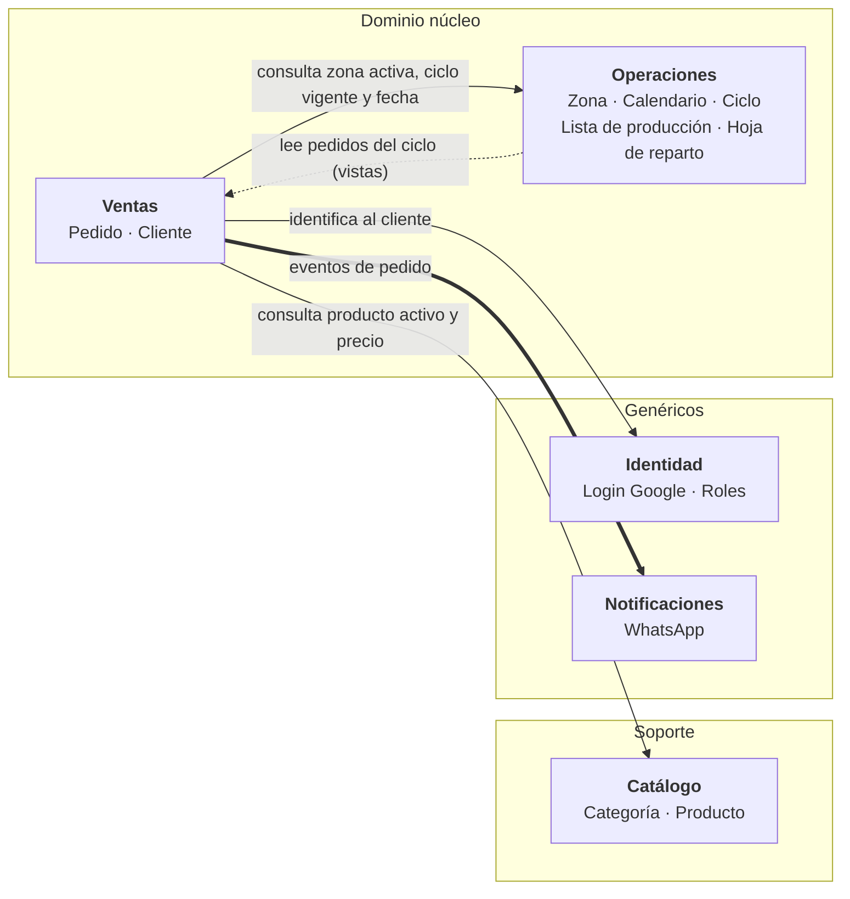
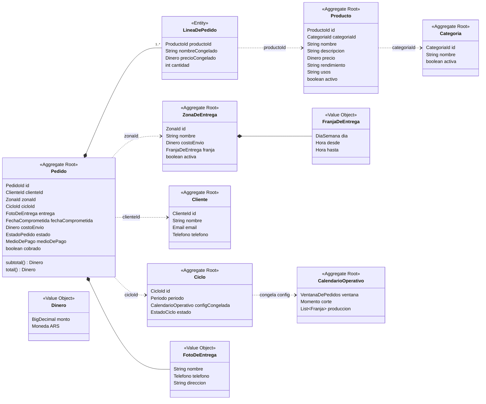
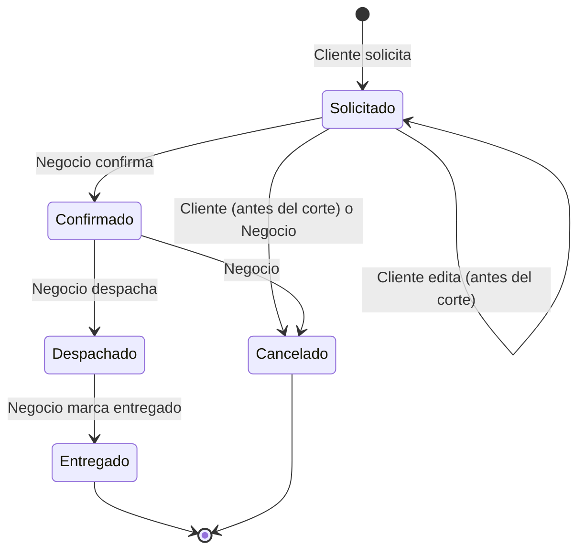
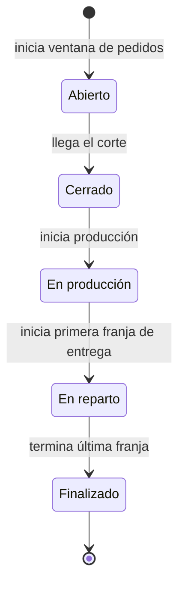

# Modelo de Dominio — VerdeDeMas

> Modelo **to-be conceptual** producido en la Fase 1 (ver `docs/phases/fase-1-entender-el-dominio.md`).
> Describe cómo funciona el negocio, no cómo está implementado hoy. Las brechas contra el código
> actual están relevadas en `docs/domain/business-rules.md`.
>
> Cada concepto está etiquetado como **MVP** (próximo objetivo) o **Futuro** (visión, no se implementa todavía).
>
> Última actualización: 2026-09-28.

## Visión

VerdeDeMas es una app con dos caras:

- **E-commerce** para el *Cliente*: arma y solicita pedidos, los edita mientras se puede, consulta su estado.
- **CRM** para el *Negocio*: gestiona pedidos por ciclo, produce en tandas y reparte por zona.

El negocio trabaja en **ciclos semanales**: se toman pedidos durante una ventana, hay un **corte**,
se produce en tanda y se entrega por zona en la franja de cada una. Todo el calendario es configurable.

## 1. Glosario (Lenguaje Ubicuo)

| Término | Definición | Nombre en código actual | Etiqueta |
|---|---|---|---|
| **Cliente** | Persona con cuenta (login con Google) que solicita pedidos. | — (no existe; hoy son campos sueltos en `Order`) | MVP |
| **Negocio** (Admin) | Quien opera el CRM. Se crea manualmente en BD con rol ADMIN; también se autentica con Google. | — | MVP |
| **Categoría** | Agrupación de productos del catálogo. | `Category` | MVP |
| **Producto** | Lo que se vende. Pertenece a exactamente una categoría. | `Product` | MVP |
| **Dinero** | Monto en ARS. Value object. | `BigDecimal` (primitivo) | MVP |
| **Zona de entrega** | Área geográfica que el Negocio recorre para entregar, con su costo de envío y su franja. | `DeliveryZone` | MVP |
| **Franja de entrega** | Día de la semana + rango horario en que se entrega en una zona. Value object. | `DeliveryDay` (enum) + `deliveryDay` (String) | MVP |
| **Calendario operativo** | Configuración global: ventana de toma de pedidos, corte y días/horarios de producción. | — (hardcodeado con `TemporalAdjusters`) | MVP |
| **Corte** | Momento en que cierra la toma de pedidos de un ciclo. Pedidos posteriores entran al ciclo siguiente. | — | MVP |
| **Ciclo** | Una instancia semanal concreta del calendario (ej. *Ciclo 2026-S40*), con la configuración congelada al nacer. | — | MVP |
| **Pedido** | Solicitud de compra de un cliente, asignada a un ciclo y una zona. | `Order` | MVP |
| **Línea de pedido** | Producto + cantidad, con nombre y precio congelados al momento de agregarse. | `OrderItem` (`priceAtTime`) | MVP |
| **Foto de entrega** | Datos de a quién y adónde se entrega *este* pedido (nombre, teléfono, dirección). Value object. | `customerName`, `customerPhone`, `customerAddress` | MVP |
| **Fecha comprometida** | Fecha y franja de entrega prometida al cliente; se congela al solicitar. | — (se recalcula en cada respuesta) | MVP |
| **Solicitar pedido** | Acción del cliente que crea el pedido (reemplaza el "checkout a WhatsApp"). | `createAndSendToWhatsApp` | MVP |
| **Medio de pago** | Cómo pagará el cliente (efectivo / transferencia). | — | MVP |
| **Cobrado** | Marca del Negocio indicando que el pedido fue pagado. Ortogonal al estado. | — | MVP |
| **Lista de producción** | Vista: total a producir por producto en un ciclo. | — | MVP |
| **Hoja de reparto** | Vista: pedidos a entregar por zona y franja en un ciclo. | — | MVP |
| **Ficha de cliente** | Vista CRM: historial, contacto y notas de un cliente. | — | Futuro |
| **Pago online** | Cobro integrado (ej. Mercado Pago). | — | Futuro |
| **Notificación** | Aviso por WhatsApp disparado por un evento de dominio. No es parte del dominio. | `generateWhatsAppLink` | MVP |

## 2. Mapa de Contextos

- Los contextos serán los **módulos** del monolito modular (Fase 5).
- *Cliente* vive en **Ventas**: para el dominio es "quien compra y a quien se le entrega". La cuenta
  de Google es solo el mecanismo de identificación (Identidad).
- Notificaciones reacciona a eventos; Ventas no conoce a WhatsApp.

## 3. Agregados

Cada agregado se referencia con otros **solo por ID**. Todos son **MVP**.

Leyenda: `*--` composición (dentro del agregado) · `..>` referencia por ID (entre agregados).

**Decisión clave:** el *Ciclo* **no contiene** los pedidos; el pedido referencia el `CicloId`. Un
agregado con cientos de pedidos adentro generaría contención en cada compra ("agregados chicos").

**Vistas (no son agregados):** *Lista de producción* y *Hoja de reparto* se derivan de los pedidos
de un ciclo. *Ficha de cliente* (Futuro) se deriva de los pedidos de un cliente.

## 4. Estados del Pedido

- *Cobrado* es una marca independiente del estado (se puede cobrar antes o después de entregar).
- "En preparación" no es un estado del pedido: es un estado del **Ciclo**.
- `PENDING` y `SENT_TO_WHATSAPP` del código actual se unifican en **Solicitado**.

## 5. Estados del Ciclo

## 6. Invariantes por Agregado

**Categoría**
- El nombre es único.
- No se puede desactivar si tiene productos activos.
- Solo es visible en el catálogo si tiene al menos 1 producto activo (regla de visibilidad, no de creación).

**Producto**
- Precio > 0.
- Pertenece a exactamente una categoría.
- Un producto inactivo no puede agregarse a pedidos nuevos; los pedidos existentes no se ven afectados.

**Zona de entrega**
- Costo de envío > 0.
- Tiene exactamente una franja de entrega.
- La franja debe caer **después** del fin de la producción del ciclo.
- Una zona inactiva no admite pedidos nuevos; los existentes siguen su curso.

**Calendario operativo**
- Instancia única.
- El corte es posterior al inicio de la ventana y anterior al inicio de la producción.
- Un cambio de configuración solo afecta a ciclos futuros.

**Ciclo**
- Congela la configuración del calendario con la que nació.
- Los estados avanzan solo hacia adelante.

**Pedido**
- Tiene al menos una línea; cantidad por línea entre 1 y 999.
- `total = subtotal + costoEnvío`, con `subtotal = Σ(precioCongelado × cantidad)`.
- Nombre y precio de cada línea se congelan al agregarla; las líneas nuevas toman el precio vigente.
- La fecha comprometida se congela al solicitar; se recalcula solo si el cliente cambia de zona mientras puede editar.
- El cliente puede editar o cancelar solo en estado *Solicitado* **y** antes del corte de su ciclo.
- Pasado eso, solo el Negocio cambia el estado.
- Solo se puede cancelar desde *Solicitado* o *Confirmado*.

## 7. Eventos de Dominio

Disparados por el agregado *Pedido* y consumidos (entre otros) por Notificaciones:

`PedidoSolicitado` · `PedidoModificado` · `PedidoConfirmado` · `PedidoCancelado` · `PedidoDespachado` · `PedidoEntregado` · `PedidoCobrado`

Del *Ciclo*: `CicloCerrado` (habilita la Lista de producción definitiva).

## 8. Preguntas Abiertas

- **Capacidad de producción por ciclo** (límite por producto): fuera del modelo hasta que exista un problema real.
- **Pedido despachado no entregado** (cliente ausente): no es una cancelación; falta definir si es un estado propio o una reprogramación.
- **Reprogramar un pedido** a otro ciclo por decisión del Negocio: mencionado, sin reglas definidas.
